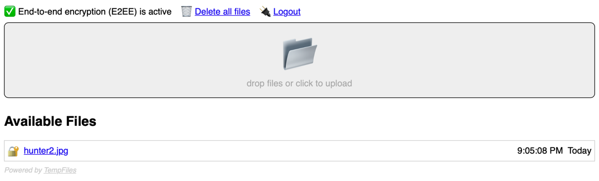

# TempFiles

This is a web-based tool for sharing files between your own computers,
with physical access.

It provides end-to-end encryption, backed by a passkey, such as FaceID or a Yubikey. **Passkeys are mandatory**.

As of 2025-08-30, you will have the best results by using QR codes and your phone to register and login; while other
devices are supported, functionality varies by OS, browser, and device. Some browsers may crash on some platforms in
some configurations - phone-based passkeys are currently the most reliable for the features that TempFiles uses.

It is written in Rust and Typescript, using Rocket, React, and Vite. Encryption is using AES-GCM.



## Why

On clients, it is near-zero-config; this makes it ideal for sharing things like password manager master keys to newly
reimaged machines.

## Deployment

### Server-side (Rust)

After cloning the repo, first, create the database. This must be done first as the database queries are validated at
build time.

```
sqlite3 db.sqlite < schema.sql
```

Then, copy `Rocket.toml` to `Rocket.local.toml`, and edit it to match your environment.

Once the configuration file is ready, build and initialize the server:

```
ROCKET_CONFIG=Rocket.local.toml cargo run --release -- init
```

This will prompt you to create the first user; it will show you a registration code you will need to keep for later. If
the code expires before you use it, you can recreate it with `cargo run --relesae add-user USERNAME --force`

Finally, run the server:

```
ROCKET_CONFIG=Rocket.local.toml cargo run --release -- serve
```

### Client-side (TypeScript)

Install node and npm in your preferred manner, then:

```
cd www
npm run build
```

### Adding additional users

```
cargo run add-user USERNAME
```

## Development

- Use `npm run dev` to run dev in development mode
- Use `cargo run gen-ts` to update the TypeScript types that are generated from Rust
- Use `npm run tsc --noEmit` to run the TypeScript compiler without generating JavaScript output;
  vite takes care of generating JavaScript, but this is useful for checking the project as a whole